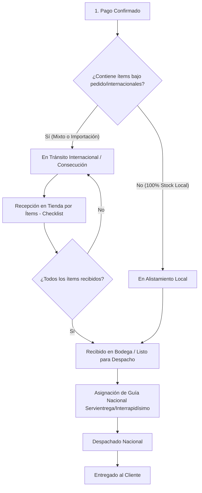

# Plan de Implementación: Envíos Internacionales y Bajo Pedido (Consolidación en Tienda)

Este documento detalla la arquitectura, modelo de datos, lógica de negocio y experiencia de usuario (UX/UI) para gestionar repuestos con diferentes orígenes logísticos (**Stock Inmediato**, **Bajo Pedido Nacional** e **Importación Internacional**) y su consolidación antes del despacho nacional.

---

## 1. Resumen Ejecutivo y Estrategia Logística

### Objetivo
Permitir a los clientes comprar tanto repuestos disponibles en stock local como piezas que requieren importación o consecución especial, unificando el despacho en un **único paquete nacional** una vez que todos los ítems lleguen a la bodega/tienda física, evitando costos de flete duplicados y manteniendo al cliente informado en cada etapa.

### Las 3 Modalidades de Repuestos

| Modalidad | Origen | Plazo de llegada a tienda | Despacho final al cliente |
| :--- | :--- | :--- | :--- |
| **🟢 Stock Inmediato** (`in_stock`) | Bodega local física | Inmediato (0 días) | 24 - 48 hrs hábiles con transportadora nacional |
| **🟡 Bajo Pedido Nacional** (`national_on_demand`) | Distribuidor / Ensambladora CO | 3 a 7 días hábiles | Despacho nacional al recibir en tienda |
| **🔵 Importación Internacional** (`international`) | Fábrica Japón / Bodega USA | 15 a 30 días hábiles | Despacho nacional tras inspección en tienda |

---

## 2. Ciclo de Vida y Flujo de Estados del Pedido



### Detalle de Estados (`order_statuses`):
1. **`paid` (Pago Confirmado)**: El cliente pagó la orden. Se emiten órdenes de compra automáticas o manuales a los proveedores.
2. **`import_transit` (En Tránsito Internacional / Consecución)**: Las piezas viajan hacia la bodega central en Colombia.
3. **`ready_to_ship` / `warehouse_received` (Recibido en Tienda / Alistamiento)**: Todos los repuestos están físicamente en la tienda, verificados e inspeccionados.
4. **`shipped` (Despachado Nacional)**: El paquete fue entregado a la transportadora con número de guía y URL de rastreo activa.
5. **`delivered` (Entregado)**: Pedido entregado al destinatario final.

---

## 3. Modelo de Datos y Esquema Drizzle (`src/db/schema.ts`)

### A. Tabla `parts` (Catálogo de Repuestos)
Campos para tipificar la procedencia y los tiempos:
```typescript
// En parts (schema.ts)
originType: text('origin_type').notNull().default('in_stock'), // 'in_stock' | 'national_on_demand' | 'international'
leadTimeMinDays: integer('lead_time_min_days').default(0),
leadTimeMaxDays: integer('lead_time_max_days').default(0),
```

### B. Tabla `order_items` (Líneas de la Orden)
Seguimiento y checklist individual de recepción física:
```typescript
// En order_items (schema.ts)
itemStatus: text('item_status').notNull().default('pending'), // 'pending' | 'in_transit' | 'received_at_store'
receivedAt: timestamp('received_at'),
supplierTrackingNumber: text('supplier_tracking_number'),
```

### C. Tabla `orders`
Indicadores de consolidación y promesa de entrega:
```typescript
// En orders (schema.ts)
hasInternationalItems: boolean('has_international_items').notNull().default(false),
hasOnDemandItems: boolean('has_on_demand_items').notNull().default(false),
estimatedDeliveryMinDate: text('estimated_delivery_min_date'),
estimatedDeliveryMaxDate: text('estimated_delivery_max_date'),
estimatedDeliveryFormatted: text('estimated_delivery_formatted'),
shippingCarrier: text('shipping_carrier'),
trackingNumber: text('tracking_number'),
trackingUrl: text('tracking_url'),
```

---

## 4. Experiencia de Usuario (UX/UI en Tienda)

### A. Ficha del Producto (`ProductDetailModal.tsx` / `ProductCard.tsx`)
- **Badge visual:**
  - `🟢 En Stock Nacional`: "Despacho inmediato (24-48 hrs)".
  - `🟡 Bajo Pedido Nacional`: "Disponible bajo pedido (Llega a tienda en 3-7 días hábiles)".
  - `🔵 Importación Internacional`: "Importación directa Japón/USA (Llega a tienda en 15-30 días hábiles)".
- **Caja de aviso en el botón de compra:** Explica con transparencia el tiempo estimado antes de agregar al carrito.

### B. Carrito y Checkout (`CartDrawer.tsx` / `Checkout.tsx`)
- **Alerta de Pedido Mixto / Consolidado:**
  > 📦 **Envío Consolidado:** Tu pedido contiene repuestos de importación internacional. Agruparemos todas tus piezas en nuestra bodega central para despacharlas en un solo envío y ahorrarte costos adicionales.
- **Cálculo Dinámico de Entrega:**
  $$\text{Días Totales} = \max(\text{Lead Time de los ítems}) + \text{Días de Tránsito de la Transportadora}$$
  Ejemplo: Pieza importada (20 días) + Servientrega (2 días) = **Entrega estimada en 22 días hábiles (rango de fechas exacto)**.

---

## 5. Gestión Administrativa (`OrderModal.tsx` / Almacén)

### Checklist de Recepción por Ítem:
1. En la vista del pedido en el panel de administración, cada repuesto tiene un botón/checkbox:
   - `[ ] Marcar Recibido en Tienda`
2. **Automatización:**
   - Cuando el operador de bodega marca todos los ítems como recibidos, el pedido cambia automáticamente a **`Listo para Despacho`**.
3. **Despacho Nacional:**
   - Se abre el panel para seleccionar la transportadora (Servientrega, Interrapidísimo, Coordinadora, etc.) e ingresar el número de guía.
   - Al guardar, el pedido pasa a `Despachado` y se dispara la notificación al cliente (WhatsApp / Email).

---

## 6. Fases de Implementación Técnica

### Fase 1: Base de Datos y Tipos
- [ ] Agregar columnas a `parts`, `order_items` y `orders` en `src/db/schema.ts`.
- [ ] Ejecutar migración con Drizzle (`npm run db:push`).
- [ ] Actualizar interfaces TypeScript en `src/types.ts`.

### Fase 2: Lógica de Promesa de Entrega y Carrito
- [ ] Actualizar utilitario de fechas estimadas (`src/utils/deliveryEstimator.ts`).
- [ ] Añadir badges y alertas en `ProductCard`, `ProductDetailModal` y `CartDrawer`.
- [ ] Ajustar la creación de pedidos en el Checkout (`src/pages/api/orders/index.ts`).

### Fase 3: Panel Administrativo y Checklist de Recepción
- [ ] Modificar `OrderModal.tsx` para incluir el checklist de recepción por ítem.
- [ ] Crear endpoint `PUT /api/orders/[id]/items/[itemId]/status` para recepción rápida.
- [ ] Flujo de asignación de guía nacional y transición automática a "Despachado".

### Fase 4: Notificaciones al Cliente
- [ ] Plantillas de mensaje de WhatsApp / Correo para:
  1. *Pedido en proceso de importación*.
  2. *Repuestos recibidos en tienda (en empaque)*.
  3. *Pedido despachado con guía nacional*.
